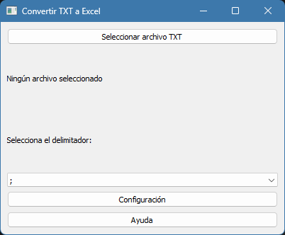
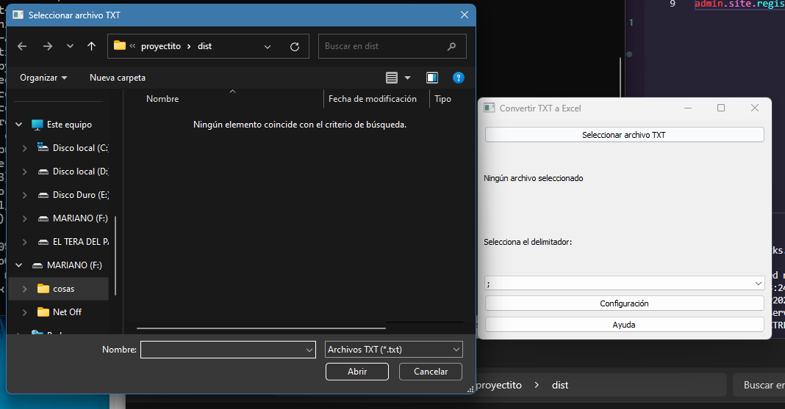
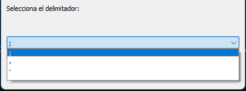
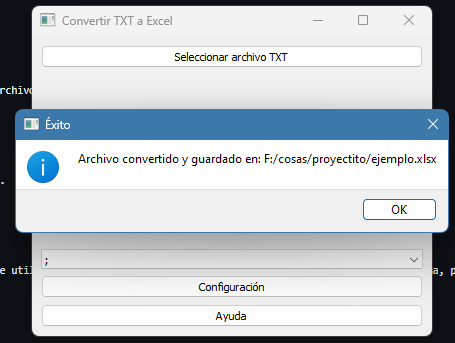

# Conversor de TXT a Excel

Esta aplicación convierte archivos `.txt` a formato Excel de manera sencilla. Permite seleccionar un archivo `.txt` y definir un delimitador para separar las celdas en el archivo Excel resultante.

## Requisitos

- Python 3.x
- Dependencias: [pandas](https://pandas.pydata.org/), [openpyxl](https://openpyxl.readthedocs.io/)

## Uso

1. **Abre la aplicación**:
    - Al ejecutar el programa, se abrirá una ventana donde podrás seleccionar un archivo `.txt` para convertir.

    

2. **Selecciona el archivo TXT**:
    - Se abrirá una ventana para que elijas el archivo `.txt` que deseas convertir.

    

3. **Elige el delimitador**:
    - Antes de la conversión, selecciona el delimitador. Este es el carácter que se utilizará para separar las celdas en el archivo Excel (por ejemplo, coma, punto y coma, tabulación, etc.).

    

4. **Conversión**:
    - Después de seleccionar el delimitador, la aplicación convertirá el archivo `.txt` a un archivo Excel. El archivo resultante se podrá guardar en el formato `.xlsx`.

    
